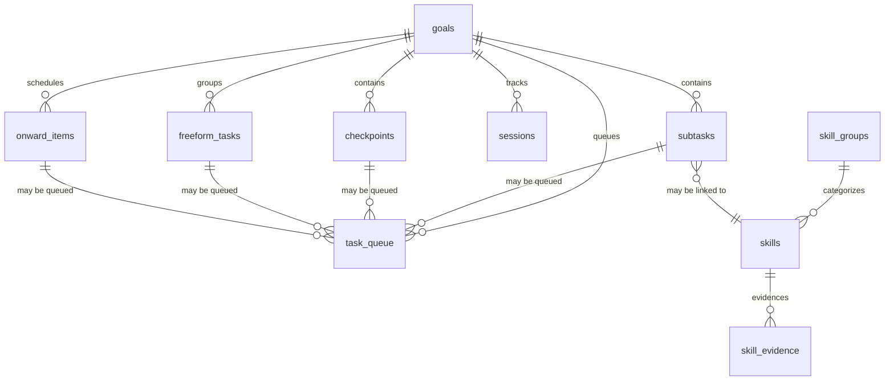
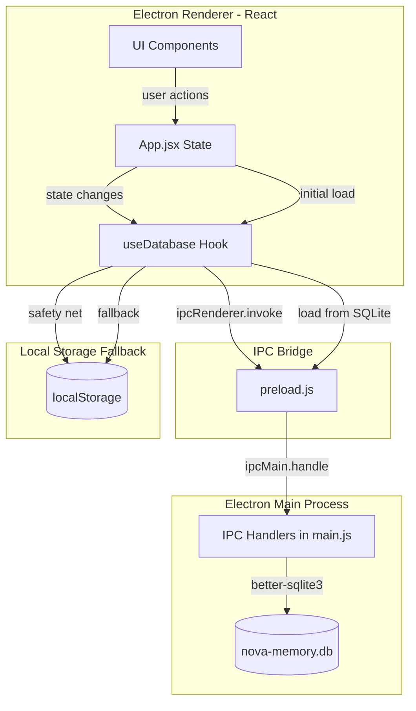

# Meridian Database Schema Plan

## Goals → Tasks → Subtasks + Stats

---

> **Decisions Made:**
> - **Database file:** `meridian-core.db` (separate from `nova-memory.db`)
> - **Stats:** Computed on-demand (when viewing tracking page), cached in `daily_stats` / `weekly_stats` tables
> - **Migration:** 3-phase dual-write strategy (safe, no data loss)

---

## 1. Current State Analysis

The app currently stores **all core data in localStorage** as JSON blobs. SQLite (`nova-memory.db`) is only used for NOVA AI companion data. The Electron IPC bridge already exists for SQLite operations.

### Current Data Entities (all localStorage)

| Key | Shape | Description |
|-----|-------|-------------|
| `meridian_projects_v2` | `Goal[]` | Goals with nested subtasks[] and checkpoints[] |
| `meridian_onward_v2` | `OnwardItem[]` | Daily scheduled tasks |
| `meridian_freeform_tasks` | `FreeformTask[]` | Unscheduled tasks |
| `meridian_sessions` | `Session[]` | Time tracking sessions |
| `meridian_skills` | `SkillsMap` | Evidence-based skill tracking |
| `meridian_selected_today` | `string[]` | Task IDs selected for today |
| `meridian_deferred` | `DeferredItem[]` | Deferred tasks |
| `meridian_backlog` | `BacklogItem[]` | Backlog tasks |
| `meridian_brain_dump` | `BrainDumpEntry[]` | Brain dump entries |
| `meridian_journal` | `JournalEntry[]` | Journal entries |
| `meridian_streak_days` | `string` | Current streak count |
| `meridian_last_active` | `string` | Last active date |

### Current Data Shapes

```typescript
// Goal (project)
interface Goal {
  id: string;
  color: string;
  pos: { x: number; y: number };
  title: string;
  desc: string;
  measurable: string;
  achievable: string;
  relevant: string;
  deadline: string;       // ISO date
  priority: 'low' | 'medium' | 'high';
  scale: 'short' | 'long';
  inFocus: boolean;
  completedAt: string | null;  // ISO datetime
  subtasks: Subtask[];
  checkpoints: Checkpoint[];
}

// Subtask (nested inside Goal)
interface Subtask {
  id: string;
  title: string;
  done: boolean;
  completedAt?: string;   // ISO datetime
  skill?: string;          // skill name for XP tracking
  notes?: string;
  createdAt?: number;      // timestamp
}

// Checkpoint (nested inside Goal)
interface Checkpoint {
  id: string;
  title: string;
  done: boolean;
  completedAt?: string;    // ISO datetime
  notes?: string;
}

// OnwardItem (daily scheduled task)
interface OnwardItem {
  id: string;
  title: string;
  hour: number;            // minutes from midnight (e.g., 480 = 8:00 AM)
  done: boolean;
  priority: string;
  goalId: string | null;
  date: string;            // Date string (e.g., "Mon Jun 10 2026")
  duration: number;        // minutes
  linkedType?: 'subtask' | 'checkpoint' | 'freeform';
  linkedId?: string;
}

// Session (time tracking)
interface Session {
  id: string;
  startTime: string;       // ISO datetime
  endTime: string | null;  // ISO datetime
  label: string;
  goalId: string | null;
}
```

---

## 2. Proposed SQLite Schema

### Core Tables

```sql
-- ============================================================
-- GOALS (replaces meridian_projects_v2 top-level fields)
-- ============================================================
CREATE TABLE IF NOT EXISTS goals (
  id            TEXT PRIMARY KEY,
  title         TEXT NOT NULL,
  description   TEXT DEFAULT '',
  measurable    TEXT DEFAULT '',
  achievable    TEXT DEFAULT '',
  relevant      TEXT DEFAULT '',
  deadline      TEXT DEFAULT '',           -- ISO date string
  priority      TEXT DEFAULT 'low',        -- 'low' | 'medium' | 'high'
  scale         TEXT DEFAULT 'short',      -- 'short' | 'long'
  color         TEXT DEFAULT '#53aaff',
  pos_x         REAL DEFAULT 0,
  pos_y         REAL DEFAULT 0,
  in_focus      INTEGER DEFAULT 0,        -- boolean
  completed_at  TEXT DEFAULT NULL,         -- ISO datetime | NULL
  created_at    TEXT NOT NULL,             -- ISO datetime
  updated_at    TEXT NOT NULL              -- ISO datetime
);

-- ============================================================
-- SUBTASKS (replaces nested subtasks[] inside goals)
-- ============================================================
CREATE TABLE IF NOT EXISTS subtasks (
  id            TEXT PRIMARY KEY,
  goal_id       TEXT NOT NULL REFERENCES goals(id) ON DELETE CASCADE,
  title         TEXT NOT NULL,
  done          INTEGER DEFAULT 0,         -- boolean
  completed_at  TEXT DEFAULT NULL,         -- ISO datetime | NULL
  skill         TEXT DEFAULT NULL,         -- skill name for XP tracking
  notes         TEXT DEFAULT NULL,
  sort_order    INTEGER DEFAULT 0,         -- for preserving display order
  created_at    TEXT NOT NULL,             -- ISO datetime
  updated_at    TEXT NOT NULL              -- ISO datetime
);

CREATE INDEX idx_subtasks_goal_id ON subtasks(goal_id);
CREATE INDEX idx_subtasks_done ON subtasks(done);

-- ============================================================
-- CHECKPOINTS (replaces nested checkpoints[] inside goals)
-- ============================================================
CREATE TABLE IF NOT EXISTS checkpoints (
  id            TEXT PRIMARY KEY,
  goal_id       TEXT NOT NULL REFERENCES goals(id) ON DELETE CASCADE,
  title         TEXT NOT NULL,
  done          INTEGER DEFAULT 0,         -- boolean
  completed_at  TEXT DEFAULT NULL,         -- ISO datetime | NULL
  notes         TEXT DEFAULT NULL,
  sort_order    INTEGER DEFAULT 0,         -- for preserving display order
  created_at    TEXT NOT NULL,             -- ISO datetime
  updated_at    TEXT NOT NULL              -- ISO datetime
);

CREATE INDEX idx_checkpoints_goal_id ON checkpoints(goal_id);
CREATE INDEX idx_checkpoints_done ON checkpoints(done);

-- ============================================================
-- ONWARD ITEMS (replaces meridian_onward_v2)
-- Daily scheduled tasks with time blocks
-- ============================================================
CREATE TABLE IF NOT EXISTS onward_items (
  id            TEXT PRIMARY KEY,
  title         TEXT NOT NULL,
  hour          INTEGER NOT NULL,          -- minutes from midnight (e.g., 480 = 8:00 AM)
  done          INTEGER DEFAULT 0,         -- boolean
  priority      TEXT DEFAULT 'low',
  goal_id       TEXT DEFAULT NULL REFERENCES goals(id) ON DELETE SET NULL,
  date          TEXT NOT NULL,              -- date string (e.g., "Mon Jun 10 2026")
  duration      INTEGER DEFAULT 60,        -- minutes
  linked_type   TEXT DEFAULT NULL,         -- 'subtask' | 'checkpoint' | 'freeform' | NULL
  linked_id     TEXT DEFAULT NULL,
  sort_order    INTEGER DEFAULT 0,
  created_at    TEXT NOT NULL,
  updated_at    TEXT NOT NULL
);

CREATE INDEX idx_onward_items_date ON onward_items(date);
CREATE INDEX idx_onward_items_goal_id ON onward_items(goal_id);

-- ============================================================
-- SESSIONS (replaces meridian_sessions)
-- Time tracking sessions linked to goals
-- ============================================================
CREATE TABLE IF NOT EXISTS sessions (
  id            TEXT PRIMARY KEY,
  start_time    TEXT NOT NULL,              -- ISO datetime
  end_time      TEXT DEFAULT NULL,          -- ISO datetime | NULL
  label         TEXT DEFAULT '',
  goal_id       TEXT DEFAULT NULL REFERENCES goals(id) ON DELETE SET NULL,
  created_at    TEXT NOT NULL
);

CREATE INDEX idx_sessions_start_time ON sessions(start_time);
CREATE INDEX idx_sessions_goal_id ON sessions(goal_id);

-- ============================================================
-- FREEFORM TASKS (replaces meridian_freeform_tasks)
-- Unscheduled tasks not yet placed on the calendar
-- ============================================================
CREATE TABLE IF NOT EXISTS freeform_tasks (
  id            TEXT PRIMARY KEY,
  title         TEXT NOT NULL,
  goal_id       TEXT DEFAULT NULL REFERENCES goals(id) ON DELETE SET NULL,
  created_at    TEXT NOT NULL,
  updated_at    TEXT NOT NULL
);

-- ============================================================
-- SKILLS (replaces meridian_skills)
-- Evidence-based skill tracking with hours and evidence
-- ============================================================
CREATE TABLE IF NOT EXISTS skill_groups (
  id            TEXT PRIMARY KEY,
  name          TEXT NOT NULL UNIQUE,
  color         TEXT DEFAULT '#53aaff',
  sort_order    INTEGER DEFAULT 0,
  created_at    TEXT NOT NULL,
  updated_at    TEXT NOT NULL
);

CREATE TABLE IF NOT EXISTS skills (
  id              TEXT PRIMARY KEY,
  group_id        TEXT NOT NULL REFERENCES skill_groups(id) ON DELETE CASCADE,
  name            TEXT NOT NULL,
  hours           REAL DEFAULT 0,           -- deliberate practice hours
  last_applied    TEXT DEFAULT NULL,         -- ISO datetime | NULL
  evidence_count  INTEGER DEFAULT 0,
  notes           TEXT DEFAULT '',
  manual_status   TEXT DEFAULT NULL,         -- 'active' | 'maintenance' | 'stale' | 'learning' | NULL
  target_stage    INTEGER DEFAULT NULL,      -- target proficiency stage index
  sort_order      INTEGER DEFAULT 0,
  created_at      TEXT NOT NULL,
  updated_at      TEXT NOT NULL,
  UNIQUE(group_id, name)
);

CREATE INDEX idx_skills_group_id ON skills(group_id);

-- Evidence records linking skill practice to specific tasks
CREATE TABLE IF NOT EXISTS skill_evidence (
  id            TEXT PRIMARY KEY,
  skill_id      TEXT NOT NULL REFERENCES skills(id) ON DELETE CASCADE,
  source        TEXT NOT NULL,              -- e.g., 'subtask', 'session'
  source_id     TEXT DEFAULT NULL,          -- ID of the source entity
  description   TEXT DEFAULT '',            -- e.g., goal title context
  hours_added   REAL DEFAULT 0,
  created_at    TEXT NOT NULL
);

CREATE INDEX idx_skill_evidence_skill_id ON skill_evidence(skill_id);

-- ============================================================
-- STATS & TRACKING TABLES
-- ============================================================

-- Daily stats (computed/aggregated per day)
CREATE TABLE IF NOT EXISTS daily_stats (
  date              TEXT PRIMARY KEY,        -- ISO date (YYYY-MM-DD)
  total_minutes     INTEGER DEFAULT 0,       -- total tracked time
  focused_minutes   INTEGER DEFAULT 0,       -- sessions >= 25 min
  productive_minutes INTEGER DEFAULT 0,      -- sessions with goal_id
  sessions_count    INTEGER DEFAULT 0,
  subtasks_completed INTEGER DEFAULT 0,
  checkpoints_completed INTEGER DEFAULT 0,
  pomodoros_completed INTEGER DEFAULT 0,
  streak_day        INTEGER DEFAULT 0,       -- 1 if this day contributed to streak
  created_at        TEXT NOT NULL,
  updated_at        TEXT NOT NULL
);

-- Weekly stats (computed/aggregated per ISO week)
CREATE TABLE IF NOT EXISTS weekly_stats (
  year_week         TEXT PRIMARY KEY,        -- e.g., "2026-W24"
  year              INTEGER NOT NULL,
  week              INTEGER NOT NULL,
  total_minutes     INTEGER DEFAULT 0,
  focused_minutes   INTEGER DEFAULT 0,
  productive_minutes INTEGER DEFAULT 0,
  sessions_count    INTEGER DEFAULT 0,
  subtasks_completed INTEGER DEFAULT 0,
  checkpoints_completed INTEGER DEFAULT 0,
  pomodoros_completed INTEGER DEFAULT 0,
  streak_days       INTEGER DEFAULT 0,
  created_at        TEXT NOT NULL,
  updated_at        TEXT NOT NULL
);

-- ============================================================
-- INGESTION & SORTING STATE (replaces meridian_selected_today, deferred, backlog)
-- ============================================================
CREATE TABLE IF NOT EXISTS task_queue (
  id              TEXT PRIMARY KEY,
  queue_type      TEXT NOT NULL,             -- 'selected_today' | 'deferred' | 'backlog'
  item_type       TEXT NOT NULL,             -- 'subtask' | 'checkpoint' | 'freeform' | 'onward'
  item_id         TEXT NOT NULL,             -- ID of the referenced item
  goal_id         TEXT DEFAULT NULL REFERENCES goals(id) ON DELETE SET NULL,
  title           TEXT DEFAULT '',
  sort_order      INTEGER DEFAULT 0,
  created_at      TEXT NOT NULL
);

CREATE INDEX idx_task_queue_type ON task_queue(queue_type);

-- ============================================================
-- BRAIN DUMP & JOURNAL (replaces meridian_brain_dump, meridian_journal)
-- ============================================================
CREATE TABLE IF NOT EXISTS brain_dump_entries (
  id            TEXT PRIMARY KEY,
  content       TEXT NOT NULL,
  created_at    TEXT NOT NULL               -- ISO datetime
);

CREATE TABLE IF NOT EXISTS journal_entries (
  id            TEXT PRIMARY KEY,
  content       TEXT NOT NULL,
  created_at    TEXT NOT NULL               -- ISO datetime
);

-- ============================================================
-- ROUTINES (replaces routines state in App.jsx)
-- ============================================================
CREATE TABLE IF NOT EXISTS routines (
  id            TEXT PRIMARY KEY,
  phase         TEXT NOT NULL,              -- 'before' | 'during' | 'after'
  text          TEXT NOT NULL,
  sort_order    INTEGER DEFAULT 0,
  created_at    TEXT NOT NULL,
  updated_at    TEXT NOT NULL
);
```

---

## 3. Entity Relationship Diagram



---

## 4. Migration Strategy

### Phase 1: Schema Creation & Dual-Write (Non-Breaking)

1. **Create the new SQLite schema** in [`src/db/schema.js`](src/db/schema.js) — add all new tables alongside existing NOVA tables
2. **Add IPC handlers** in [`main.js`](main.js:128) for all new tables (CRUD operations)
3. **Expose IPC handlers** in [`preload.js`](preload.js:1) via `window.electronAPI` or a new `window.meridianDB` namespace
4. **Add dual-write hooks** in [`src/App.jsx`](src/App.jsx:31) — on every state change, write to both localStorage (existing) AND SQLite (new)
5. **No UI changes** — everything continues to work exactly as before

### Phase 2: Read from SQLite

1. **Replace localStorage reads** with SQLite reads on app startup
2. **Keep localStorage writes** as fallback/safety net
3. **Verify data integrity** — compare localStorage vs SQLite data

### Phase 3: Remove localStorage

1. **Remove localStorage persistence hooks** from [`src/App.jsx`](src/App.jsx:311)
2. **Remove localStorage initial state reads** from [`src/App.jsx`](src/App.jsx:32)
3. **Clean up** unused localStorage keys

### Rollback Plan

- localStorage is never deleted during Phase 1 or 2
- If SQLite has issues, revert to localStorage reads (Phase 2 rollback)
- Phase 3 is only done after thorough testing

---

## 5. Implementation Steps

### Step 1: Update Schema File

**File:** [`src/db/schema.js`](src/db/schema.js)

Add all new table definitions (from Section 2 above) to the exported SQL string, keeping existing NOVA tables intact.

### Step 2: Add IPC Handlers in main.js

**File:** [`main.js`](main.js:128)

Add new IPC handlers following the existing pattern:

| Channel | Operation | Description |
|---------|-----------|-------------|
| `db:goal:save` | INSERT/UPDATE | Upsert a goal |
| `db:goal:get-all` | SELECT | Get all goals |
| `db:goal:delete` | DELETE | Delete a goal (cascades to subtasks/checkpoints) |
| `db:subtask:save` | INSERT/UPDATE | Upsert a subtask |
| `db:subtask:get-by-goal` | SELECT | Get subtasks for a goal |
| `db:subtask:delete` | DELETE | Delete a subtask |
| `db:checkpoint:save` | INSERT/UPDATE | Upsert a checkpoint |
| `db:checkpoint:get-by-goal` | SELECT | Get checkpoints for a goal |
| `db:checkpoint:delete` | DELETE | Delete a checkpoint |
| `db:onward:save` | INSERT/UPDATE | Upsert an onward item |
| `db:onward:get-by-date` | SELECT | Get onward items for a date |
| `db:onward:delete` | DELETE | Delete an onward item |
| `db:session:save` | INSERT/UPDATE | Upsert a session |
| `db:session:get-range` | SELECT | Get sessions in a date range |
| `db:session:delete` | DELETE | Delete a session |
| `db:stats:get-daily` | SELECT | Get daily stats for a date range |
| `db:stats:compute-daily` | AGGREGATE | Compute and store daily stats |
| `db:task-queue:save` | INSERT/UPDATE | Upsert task queue items |
| `db:task-queue:get-by-type` | SELECT | Get queue items by type |
| `db:task-queue:delete` | DELETE | Delete queue items |
| `db:brain-dump:save` | INSERT | Save brain dump entry |
| `db:brain-dump:get-all` | SELECT | Get all brain dump entries |
| `db:journal:save` | INSERT | Save journal entry |
| `db:journal:get-all` | SELECT | Get all journal entries |
| `db:skill:save` | INSERT/UPDATE | Upsert skill data |
| `db:skill:get-all` | SELECT | Get all skills with groups |
| `db:skill:add-evidence` | INSERT | Add skill evidence record |

### Step 3: Update preload.js

**File:** [`preload.js`](preload.js:1)

Expose all new IPC channels via `contextBridge.exposeInMainWorld`.

### Step 4: Create Database Service Hook

**New File:** [`src/hooks/useDatabase.js`](src/hooks/useDatabase.js)

Create a React hook that provides:
- `loadAll()` — load all data from SQLite on startup
- `saveGoal(goal)` — persist a goal
- `saveSubtask(subtask)` — persist a subtask
- `saveCheckpoint(checkpoint)` — persist a checkpoint
- `saveOnwardItem(item)` — persist an onward item
- `saveSession(session)` — persist a session
- `saveTaskQueue(type, items)` — persist task queue
- `saveBrainDump(entry)` — persist brain dump
- `saveJournal(entry)` — persist journal entry
- `saveSkills(skills)` — persist skills
- `computeDailyStats(date)` — compute and store daily stats

### Step 5: Integrate into App.jsx

**File:** [`src/App.jsx`](src/App.jsx:31)

1. Add dual-write calls in all state setters that modify persisted data
2. On startup, load from SQLite instead of localStorage (or as fallback)
3. Keep localStorage as a parallel persistence layer initially

### Step 6: Stats Computation

**New File:** [`src/utils/stats.js`](src/utils/stats.js)

Create utility functions for:
- `computeDailyStats(date, sessions, subtasks, checkpoints)` — aggregate daily stats
- `computeWeeklyStats(yearWeek)` — aggregate weekly stats from daily stats
- `computeStreak(dailyStats)` — calculate current streak from daily stats

### Step 7: Testing

1. Verify all CRUD operations work via IPC
2. Verify data persists across app restarts
3. Verify stats are computed correctly
4. Verify migration from localStorage to SQLite preserves all data

---

## 6. Data Flow Diagram



---

## 7. Key Design Decisions

1. **Keep existing NOVA tables untouched** — they work fine and are separate from core app data
2. **Use TEXT for all timestamps** — ISO 8601 strings are human-readable and sortable; SQLite has good TEXT comparison
3. **Use INTEGER for booleans** — SQLite convention (0/1 instead of TRUE/FALSE)
4. **CASCADE deletes** — deleting a goal cascades to its subtasks and checkpoints
5. **SET NULL for goal references** — deleting a goal sets `goal_id = NULL` on sessions/onward items (preserves history)
6. **Dual-write strategy** — write to both SQLite and localStorage during migration for safety
7. **Stats are computed, not real-time** — daily stats are computed on-demand or at end of day, not updated on every action
8. **Separate skill_evidence table** — allows tracking which specific tasks contributed to skill growth
9. **sort_order columns** — preserve the display order of subtasks/checkpoints as the user arranged them
10. **No schema migrations yet** — this is the initial schema; future migrations can use version checks

---

## 8. Resolved Decisions

| Question | Decision |
|----------|----------|
| Database file name | `meridian-core.db` (separate from `nova-memory.db`) |
| Stats computation | On-demand, cached in `daily_stats` / `weekly_stats` tables |
| Keep `save-state`/`load-state`? | Yes — keep as full-state backup mechanism during migration |
| PathsView migration | Yes — migrate `meridian_projects` to use the same `goals` table |
