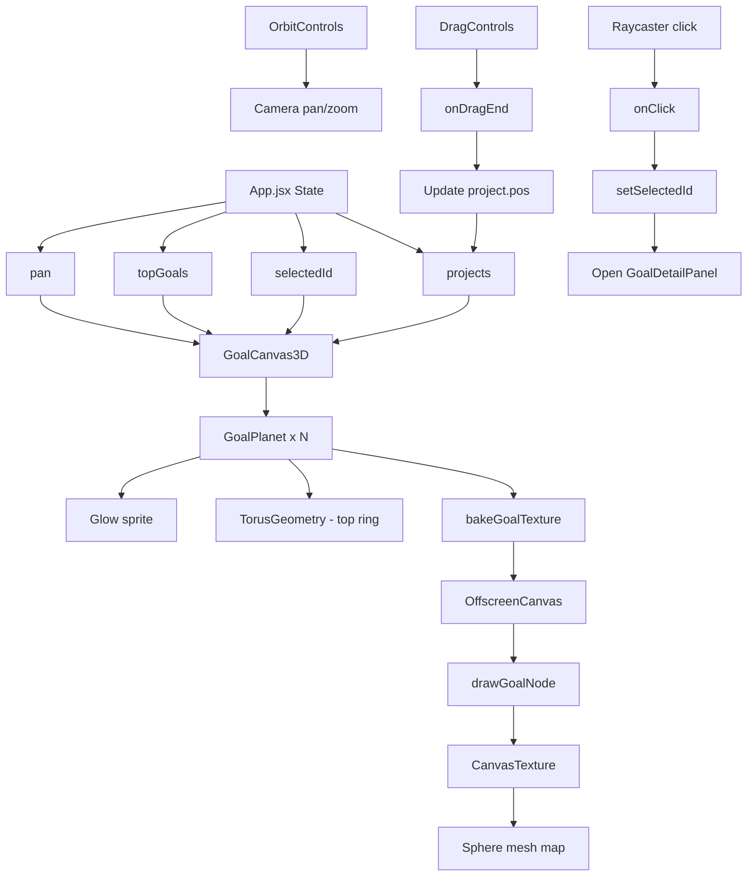
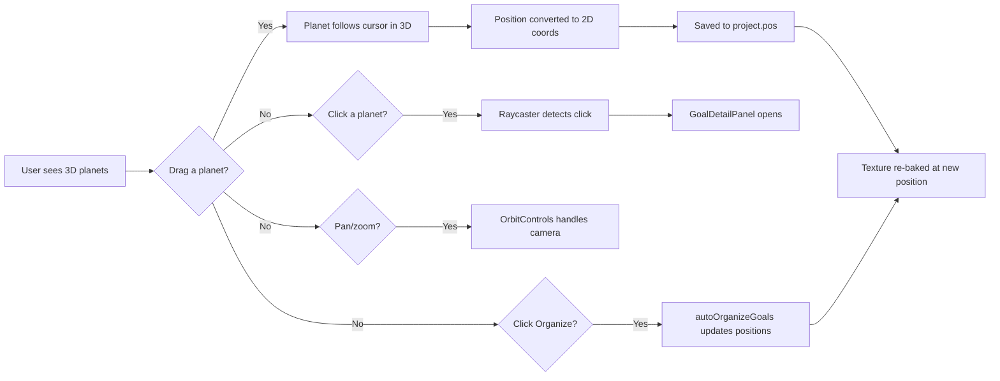

# 3D Goal Planet Rendering Plan

## Overview

Replace the current 2D canvas-based goal rendering system with a **3D sphere (planet) per goal** rendered in a real-time 3D environment using **React Three Fiber (R3F)**. Each goal's existing 2D visual appearance — colors, text, progress arcs, status badges, icons, and layout proportions — will be preserved exactly as-is by baking the 2D canvas rendering onto a texture that wraps seamlessly around each sphere. The 3D planets will orbit/position according to the current page/layout coordinates, maintaining identical relative positioning and scaling.

---

## Current Architecture (2D Canvas)

The goals page currently renders via:

1. [`src/utils/drawPages.js`](src/utils/drawPages.js:907-1026) — `drawGoalsPage()` renders each goal as a 2D circular node on an HTML `<canvas>` element
2. [`src/utils/canvas.js`](src/utils/canvas.js) — Drawing utilities: `drawGlow()`, `drawProgressArc()`, `drawSubtaskNode()`, `drawCheckpointNode()`, `rrect()`
3. [`src/utils/layout.js`](src/utils/layout.js) — `autoOrganizeGoals()` positions goals in a grid
4. [`src/utils/helpers.js`](src/utils/helpers.js:5) — `projectPos()` generates initial positions
5. [`src/App.jsx`](src/App.jsx:539-581) — `requestAnimationFrame` loop renders all pages on a single `<canvas>`
6. [`src/App.jsx`](src/App.jsx:1006-1082) — Canvas mouse handlers for drag/pan/click

### Current Goal Node Visual Elements (per `drawGoalsPage`)

Each goal node at position `(px, py)` with radius `nodeR = 28 * dpr` consists of:

| Element | Lines | Description |
|---------|-------|-------------|
| Glow (selected) | 950-951 | Radial gradient glow behind selected goal |
| Top goal ring | 953-961 | Outer ring stroke at `nodeR + 6*dpr`, 3*dpr thick |
| Node body | 963-972 | Filled circle `rgba(color, .15)`, stroked with `color` or `rgba(color, .5)` |
| Progress arc | 975 | Arc around node at `nodeR + 3*dpr`, using `drawProgressArc()` |
| Status badge (complete) | 978-992 | Green circle with checkmark at `(px+nodeR-4, py-nodeR+4)` |
| Status badge (incomplete) | 993-1009 | Red circle with cross at `(px+nodeR-4, py-nodeR+4)` |
| Title label | 1012-1019 | Text centered below node at `(px, py + nodeR + 5*dpr)` |
| Hit area | 1022 | Circular hit area for click detection |

---

## Proposed Architecture (3D Planets)

### High-Level Design

```
┌─────────────────────────────────────────────────────────────┐
│                    React Three Fiber Canvas                   │
│  ┌────────────┐  ┌────────────┐  ┌────────────┐            │
│  │  Planet 1  │  │  Planet 2  │  │  Planet 3  │  ...       │
│  │  (Sphere)  │  │  (Sphere)  │  │  (Sphere)  │            │
│  │  texture←──│──│──texture←──│──│──texture   │            │
│  │  baked     │  │  baked     │  │  baked     │            │
│  │  from 2D   │  │  from 2D   │  │  from 2D   │            │
│  │  canvas    │  │  canvas    │  │  canvas    │            │
│  └────────────┘  └────────────┘  └────────────┘            │
│                                                             │
│  ┌─────────────────────────────────────────────────────┐    │
│  │  OffscreenCanvas (texture baker)                    │    │
│  │  - Renders each goal node to a 2D canvas            │    │
│  │  - Uses exact same drawPages.js drawing code        │    │
│  │  - Produces square texture for sphere mapping       │    │
│  └─────────────────────────────────────────────────────┘    │
└─────────────────────────────────────────────────────────────┘
```

### Key Insight: Texture Baking

Rather than rewriting all drawing logic in 3D (which would be complex and risk visual mismatch), we **bake the existing 2D rendering onto an offscreen canvas** and use it as a texture on each sphere. This guarantees pixel-perfect preservation of the current visual design.

---

## Files to Create

### 1. [`src/components/goals/GoalPlanet.jsx`](src/components/goals/GoalPlanet.jsx)

A React Three Fiber component that renders a single goal as a 3D sphere with a baked texture.

**Props:**
- `project` — Goal/project object with all visual properties
- `position` — `[x, y, z]` in 3D space (mapped from 2D layout coords)
- `isSelected` — Boolean
- `isTopGoal` — Boolean
- `onClick` — Click handler
- `onDragEnd` — Drag end handler (for repositioning)
- `dpr` — Device pixel ratio

**Responsibilities:**
- Create an offscreen `<canvas>` element
- Call the existing `drawGoalNode()` (extracted from `drawGoalsPage`) to render the goal onto the offscreen canvas
- Convert the canvas to a texture via `new THREE.CanvasTexture(offscreenCanvas)`
- Render a `<mesh>` with `<sphereGeometry>` and `<meshStandardMaterial>` using the baked texture
- Add a subtle rotation animation (slow spin) for visual appeal
- Handle 3D drag interaction via `@react-three/drei`'s `DragControls` or custom raycasting
- Render the top goal ring as a separate `<mesh>` (torus geometry) around the sphere
- Render the glow effect as a sprite or a larger transparent sphere behind

### 2. [`src/components/goals/GoalCanvas3D.jsx`](src/components/goals/GoalCanvas3D.jsx)

The top-level 3D scene component that replaces the 2D canvas for the goals page.

**Props:**
- `projects` — Array of goal/project objects
- `selectedId` — Currently selected goal ID
- `topGoalIds` — Array of top goal IDs
- `onSelectGoal` — Callback when a goal is clicked
- `onUpdatePosition` — Callback when a goal is dragged to a new position
- `pan` — Pan offset `{x, y}`
- `dpr` — Device pixel ratio

**Responsibilities:**
- Set up a `<Canvas>` from `@react-three/fiber`
- Configure camera (orthographic or perspective) to match the 2D viewport
- Map 2D layout coordinates to 3D world coordinates
- Render a `GoalPlanet` for each project
- Handle camera controls (pan/zoom) via `@react-three/drei`'s `OrbitControls` or `MapControls`
- Render a starfield background (matching the current 2D star field)
- Handle click-to-select via raycasting

### 3. [`src/utils/textureBaker.js`](src/utils/textureBaker.js)

Utility to bake a goal node's 2D rendering onto an offscreen canvas for use as a sphere texture.

**Exports:**
- `bakeGoalTexture(project, dpr, isSelected, isTopGoal)` — Returns a `THREE.CanvasTexture`

**Implementation:**
- Create an offscreen canvas of size `(nodeR * 2 + padding) * dpr` square
- Get its 2D context
- Call extracted drawing functions from `drawPages.js` to render the goal node
- Return the canvas as a texture

### 4. [`src/components/goals/GoalGlow.jsx`](src/components/goals/GoalGlow.jsx)

A sprite-based glow effect rendered behind each planet (optional enhancement).

---

## Files to Modify

### 5. [`src/utils/drawPages.js`](src/utils/drawPages.js)

**Extract** the goal node drawing logic from `drawGoalsPage()` into a standalone, reusable function `drawGoalNode(ctx, px, py, nodeR, project, isSelected, isTopGoal, dpr)` that can be called both by the main canvas renderer AND the texture baker.

**Changes:**
- Extract lines 938-1023 into `drawGoalNode(ctx, px, py, nodeR, project, isSelected, isTopGoal, dpr)`
- Keep `drawGoalsPage()` calling `drawGoalNode()` for backward compatibility during transition
- The extracted function must be self-contained (no dependency on `refs` or `pan`)

### 6. [`src/App.jsx`](src/App.jsx)

**Replace** the 2D canvas rendering for the goals page with the 3D `GoalCanvas3D` component.

**Changes:**
- In the canvas draw loop (lines 557-570), keep the 2D canvas for all pages EXCEPT `goals`
- For the `goals` page, render `<GoalCanvas3D>` instead of the 2D canvas
- The 2D canvas should still exist for other pages (onward, map, paths, skills)
- Update mouse handlers: remove goal-specific click/drag logic from `onCanvasMouseDown`, `onCanvasMouseMove`, `onCanvasMouseUp` since R3F handles its own interaction
- Pass `topGoalsRef`, `selectedIdRef`, `projectsRef` to `GoalCanvas3D`

### 7. [`src/components/panels/CanvasPanelWrapper.jsx`](src/components/panels/CanvasPanelWrapper.jsx)

No changes needed — this component wraps non-goal panels.

### 8. [`package.json`](package.json)

**Add dependencies:**
```json
{
  "dependencies": {
    "@react-three/fiber": "^8.15.0",
    "@react-three/drei": "^9.88.0",
    "three": "^0.160.0"
  }
}
```

---

## Detailed Implementation Steps

### Step 1: Extract `drawGoalNode()` from `drawGoalsPage()`

**File:** [`src/utils/drawPages.js`](src/utils/drawPages.js)

Create a new exported function:

```javascript
export function drawGoalNode(ctx, px, py, nodeR, project, isSelected, isTopGoal, dpr) {
  const pct = progress(project) / 100;
  const hasSubtasks = (project.subtasks?.length || 0) > 0 || (project.checkpoints?.length || 0) > 0;
  const isComplete = !!project.completedAt;
  const color = project.color;

  // Glow if selected
  if (isSelected) drawGlow(ctx, px, py, nodeR * 1.5, color, .15);

  // Top goal ring
  if (isTopGoal) {
    ctx.save();
    ctx.beginPath();
    ctx.arc(px, py, nodeR + 6*dpr, 0, Math.PI * 2);
    ctx.strokeStyle = rgba(color, .6);
    ctx.lineWidth = 3*dpr;
    ctx.stroke();
    ctx.restore();
  }

  // Node body
  ctx.save();
  ctx.beginPath();
  ctx.arc(px, py, nodeR, 0, Math.PI * 2);
  ctx.fillStyle = rgba(color, .15);
  ctx.fill();
  ctx.strokeStyle = isSelected ? color : rgba(color, .5);
  ctx.lineWidth = isSelected ? 2*dpr : 1*dpr;
  ctx.stroke();
  ctx.restore();

  // Progress arc
  if (pct > 0) drawProgressArc(ctx, px, py, nodeR + 3*dpr, pct, color, dpr);

  // Status badge
  if (isComplete) {
    // Green checkmark badge
    ctx.save();
    ctx.beginPath();
    ctx.arc(px + nodeR - 4*dpr, py - nodeR + 4*dpr, 6*dpr, 0, Math.PI * 2);
    ctx.fillStyle = T.green;
    ctx.fill();
    ctx.strokeStyle = T.bg;
    ctx.lineWidth = 1.5*dpr;
    ctx.beginPath();
    ctx.moveTo(px + nodeR - 6*dpr, py - nodeR + 4*dpr);
    ctx.lineTo(px + nodeR - 4*dpr, py - nodeR + 6*dpr);
    ctx.lineTo(px + nodeR - 1*dpr, py - nodeR + 2*dpr);
    ctx.stroke();
    ctx.restore();
  } else if (!hasSubtasks) {
    // Red cross badge
    ctx.save();
    ctx.beginPath();
    ctx.arc(px + nodeR - 4*dpr, py - nodeR + 4*dpr, 6*dpr, 0, Math.PI * 2);
    ctx.fillStyle = T.rose;
    ctx.fill();
    ctx.strokeStyle = T.bg;
    ctx.lineWidth = 1.5*dpr;
    ctx.beginPath();
    ctx.moveTo(px + nodeR - 6*dpr, py - nodeR + 2*dpr);
    ctx.lineTo(px + nodeR - 2*dpr, py - nodeR + 6*dpr);
    ctx.moveTo(px + nodeR - 2*dpr, py - nodeR + 2*dpr);
    ctx.lineTo(px + nodeR - 6*dpr, py - nodeR + 6*dpr);
    ctx.stroke();
    ctx.restore();
  }

  // Title label
  const label = project.title.length > 14 ? project.title.slice(0, 13) + '…' : project.title;
  ctx.save();
  ctx.font = `${7*dpr}px 'IBM Plex Mono',monospace`;
  ctx.fillStyle = isSelected ? color : rgba(T.text, .6);
  ctx.textAlign = 'center';
  ctx.textBaseline = 'top';
  ctx.fillText(label, px, py + nodeR + 5*dpr);
  ctx.restore();
}
```

Then refactor `drawGoalsPage()` to call `drawGoalNode()` for each project.

### Step 2: Create `textureBaker.js`

**File:** [`src/utils/textureBaker.js`](src/utils/textureBaker.js)

```javascript
import * as THREE from 'three';
import { drawGoalNode } from './drawPages.js';

const TEXTURE_PADDING = 20; // px padding around the node in the texture

export function bakeGoalTexture(project, dpr, isSelected, isTopGoal) {
  const nodeR = 28; // base node radius in CSS px
  const padding = TEXTURE_PADDING;
  const size = (nodeR * 2 + padding * 2) * dpr;
  
  // Create offscreen canvas
  const canvas = document.createElement('canvas');
  canvas.width = size;
  canvas.height = size;
  const ctx = canvas.getContext('2d');
  
  // Clear with transparent background
  ctx.clearRect(0, 0, size, size);
  
  // Draw the goal node centered in the canvas
  const cx = size / 2;
  const cy = size / 2;
  drawGoalNode(ctx, cx, cy, nodeR * dpr, project, isSelected, isTopGoal, dpr);
  
  // Create Three.js texture
  const texture = new THREE.CanvasTexture(canvas);
  texture.needsUpdate = true;
  
  return texture;
}
```

### Step 3: Create `GoalPlanet.jsx`

**File:** [`src/components/goals/GoalPlanet.jsx`](src/components/goals/GoalPlanet.jsx)

```jsx
import React, { useMemo, useRef } from 'react';
import { useFrame } from '@react-three/fiber';
import { Text } from '@react-three/drei';
import * as THREE from 'three';
import { bakeGoalTexture } from '../../utils/textureBaker.js';

export default function GoalPlanet({ project, position, isSelected, isTopGoal, dpr, onClick }) {
  const meshRef = useRef();
  const glowRef = useRef();
  
  // Bake the 2D rendering into a texture
  const texture = useMemo(
    () => bakeGoalTexture(project, dpr, isSelected, isTopGoal),
    [project, dpr, isSelected, isTopGoal]
  );
  
  // Slow rotation animation
  useFrame((_, delta) => {
    if (meshRef.current) {
      meshRef.current.rotation.y += delta * 0.3;
    }
  });
  
  const sphereRadius = 0.5; // 3D units — scaled to match 2D proportions
  
  return (
    <group position={position}>
      {/* Glow effect behind sphere */}
      {isSelected && (
        <mesh ref={glowRef}>
          <sphereGeometry args={[sphereRadius * 1.8, 16, 16]} />
          <meshBasicMaterial
            color={project.color}
            transparent
            opacity={0.12}
            depthWrite={false}
          />
        </mesh>
      )}
      
      {/* Top goal ring */}
      {isTopGoal && (
        <mesh rotation={[Math.PI / 2, 0, 0]}>
          <torusGeometry args={[sphereRadius * 1.25, 0.04, 8, 32]} />
          <meshBasicMaterial color={project.color} transparent opacity={0.6} />
        </mesh>
      )}
      
      {/* Main sphere with baked texture */}
      <mesh
        ref={meshRef}
        onClick={onClick}
      >
        <sphereGeometry args={[sphereRadius, 32, 32]} />
        <meshStandardMaterial
          map={texture}
          transparent
          side={THREE.DoubleSide}
        />
      </mesh>
    </group>
  );
}
```

### Step 4: Create `GoalCanvas3D.jsx`

**File:** [`src/components/goals/GoalCanvas3D.jsx`](src/components/goals/GoalCanvas3D.jsx)

```jsx
import React, { useMemo } from 'react';
import { Canvas } from '@react-three/fiber';
import { OrbitControls } from '@react-three/drei';
import GoalPlanet from './GoalPlanet.jsx';

export default function GoalCanvas3D({
  projects,
  selectedId,
  topGoalIds,
  onSelectGoal,
  onUpdatePosition,
  pan,
  dpr,
}) {
  // Map 2D layout coordinates to 3D world coordinates
  // 2D: positions in CSS pixels, pan offset applied
  // 3D: scale down so 1 unit ≈ 100px, center at origin
  const SCALE = 0.01; // 100px = 1 3D unit
  
  const planets = useMemo(() => {
    return projects
      .filter(p => !p.completedAt)
      .map((p, i) => {
        const pos = p.pos || { x: 240 + i * 440, y: 270 };
        const x = (pos.x + pan.x) * SCALE;
        const y = (pos.y + pan.y) * SCALE;
        return {
          ...p,
          position: [x, -y, 0], // negate Y because 3D Y is up, 2D Y is down
          isSelected: p.id === selectedId,
          isTopGoal: topGoalIds.includes(p.id),
        };
      });
  }, [projects, selectedId, topGoalIds, pan]);
  
  return (
    <Canvas
      camera={{ position: [0, 0, 5], fov: 45, near: 0.1, far: 100 }}
      dpr={dpr}
      style={{ position: 'absolute', top: 0, left: 0, width: '100%', height: '100%' }}
    >
      <ambientLight intensity={0.8} />
      <directionalLight position={[5, 5, 5]} intensity={0.5} />
      
      {planets.map(p => (
        <GoalPlanet
          key={p.id}
          project={p}
          position={p.position}
          isSelected={p.isSelected}
          isTopGoal={p.isTopGoal}
          dpr={dpr}
          onClick={() => onSelectGoal(p.id)}
        />
      ))}
      
      <OrbitControls
        enablePan={true}
        enableZoom={true}
        enableRotate={false}
        maxDistance={15}
        minDistance={2}
      />
    </Canvas>
  );
}
```

### Step 5: Integrate into App.jsx

**File:** [`src/App.jsx`](src/App.jsx)

**Changes:**

1. Import `GoalCanvas3D`:
```javascript
import GoalCanvas3D from './components/goals/GoalCanvas3D.jsx';
```

2. In the canvas draw loop (lines 557-570), skip the 2D canvas rendering for the `goals` page:
```javascript
if (page === 'onward') {
  // ... existing onward rendering
} else if (page === 'map') {
  drawMapPage(ctx, dpr, w, h, t, refs);
} else if (page === 'paths') {
  drawPathsPage(ctx, dpr, w, h, t, refs);
} else if (page === 'skills') {
  drawSkillsPage(ctx, dpr, w, h, t, refs);
}
// Remove the else clause for 'goals' — handled by GoalCanvas3D
```

3. In the JSX, conditionally render `GoalCanvas3D` when `activePage === 'goals'`:
```jsx
{activePage === 'goals' && (
  <GoalCanvas3D
    projects={projects}
    selectedId={selectedId}
    topGoalIds={topGoals}
    onSelectGoal={(id) => {
      setSelectedId(id);
      openWaypoint({ type: 'goal', id });
    }}
    onUpdatePosition={(id, x, y) => {
      setProjects(prev => prev.map(p =>
        p.id === id ? { ...p, pos: { x, y } } : p
      ));
    }}
    pan={pan}
    dpr={window.devicePixelRatio || 1}
  />
)}
```

4. Remove goal-specific mouse handlers from `onCanvasMouseDown`, `onCanvasMouseMove`, `onCanvasMouseUp` (lines 1065-1082, 1136-1157, 1299-1323) since R3F handles its own interaction via raycasting.

### Step 6: Handle Drag Interaction in 3D

**File:** [`src/components/goals/GoalPlanet.jsx`](src/components/goals/GoalPlanet.jsx)

Add drag support using `@react-three/drei`'s `DragControls`:

```jsx
import { DragControls } from '@react-three/drei';

// Wrap the group with DragControls
<DragControls
  onDragEnd={(event) => {
    // Convert 3D position back to 2D layout coordinates
    const x = event.object.position.x / SCALE;
    const y = -event.object.position.y / SCALE;
    onDragEnd(project.id, x, y);
  }}
>
  <group position={position}>
    {/* ... sphere, glow, ring */}
  </group>
</DragControls>
```

### Step 7: Starfield Background

**File:** [`src/components/goals/GoalCanvas3D.jsx`](src/components/goals/GoalCanvas3D.jsx)

Add a starfield using `@react-three/drei`'s `Stars` component or a custom particle system:

```jsx
import { Stars } from '@react-three/drei';

// Inside Canvas:
<Stars radius={100} depth={50} count={500} factor={4} saturation={0} fade speed={1} />
```

---

## Coordinate Mapping

The critical mapping between 2D canvas coordinates and 3D world coordinates:

| 2D Canvas | 3D World |
|-----------|----------|
| `(px, py)` in CSS pixels | `(px * SCALE, -py * SCALE, 0)` where `SCALE = 0.01` |
| Pan offset `(pan.x, pan.y)` | Added to position before scaling |
| Node radius `28 * dpr` px | Sphere radius `0.5` units |
| Y-axis increases downward | Y-axis increases upward (negate) |
| Z-axis not used | Z-axis for depth (planets at z=0) |

---

## Data Flow Diagram



---

## Interaction Flow



---

## Edge Cases & Considerations

1. **Texture re-baking on state change:** When a goal's progress, selection, or top-goal status changes, the texture must be re-baked. Use `useMemo` with proper dependency array in `GoalPlanet`.

2. **Performance with many goals:** Each goal creates an offscreen canvas and texture. For >20 goals, consider:
   - Texture atlas: bake multiple goals onto a single large texture
   - LOD (Level of Detail): use lower-resolution textures for distant planets
   - Instancing: if many planets share the same appearance

3. **Transparency in textures:** The baked texture includes transparent areas (background). Use `transparent: true` on the material and `THREE.DoubleSide` to render both sides of the sphere.

4. **Text readability on sphere:** Text rendered on a sphere will appear distorted at the edges. Mitigations:
   - Keep text in the center of the texture (it maps to the front of the sphere)
   - Use a higher-resolution texture (256x256 or 512x512)
   - Consider rendering text as a separate `Text` sprite in 3D space (optional enhancement)

5. **Backward compatibility:** The extracted `drawGoalNode()` function is called by both the texture baker AND the existing `drawGoalsPage()`, so the 2D canvas rendering remains functional during transition.

6. **Electron compatibility:** Three.js and R3F work in Electron. Ensure WebGL context is available (it is, since Electron uses Chromium).

7. **Canvas resize:** The 3D canvas auto-resizes via R3F's built-in responsive handling. The `OrbitControls` camera should be configured to maintain the viewport.

8. **Hit detection:** R3F handles click detection via raycasting natively. No need for manual hit area registration.

---

## Acceptance Criteria

1. Each goal renders as a 3D sphere with the exact same visual appearance as the current 2D node (colors, text, progress arc, status badges)
2. The 3D scene replaces the 2D canvas for the Goals page only (other pages remain 2D)
3. Planets are positioned at the same relative coordinates as the current 2D layout
4. Clicking a planet selects it and opens the GoalDetailPanel sidebar
5. Dragging a planet updates its position (converted back to 2D layout coords)
6. Pan and zoom work via OrbitControls (or MapControls for constrained 2D-like navigation)
7. Top goal ring renders as a torus around the sphere
8. Selected goal glow renders as a transparent sphere behind the planet
9. Performance is acceptable (60fps with up to 30 goals)
10. All existing functionality (progress arcs, detail panel, goal creation, auto-organize) remains intact

---

## Future Enhancements (Out of Scope)

- Planet rotation speed based on goal progress
- Orbital paths between related goals
- Particle trails behind planets
- Atmospheric glow shaders
- Click-to-fly camera animation between planets
