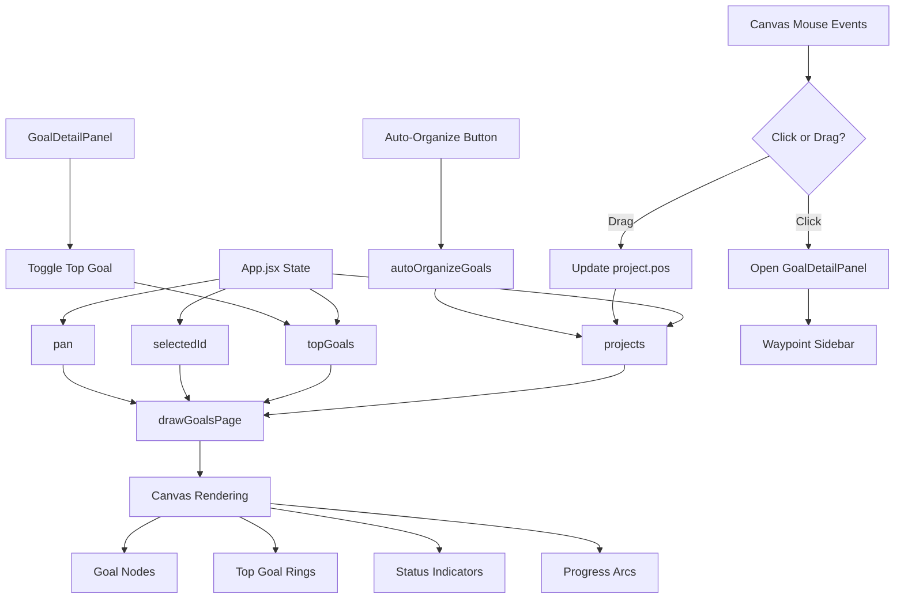
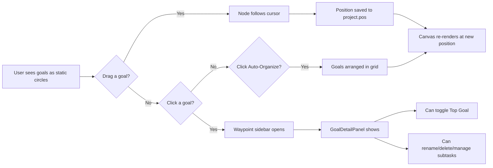

# Goal Canvas Redesign Plan

## Overview

Replace the current orbiting/animated constellation-style goal canvas with a **draggable, placeable goal canvas** where goals are rendered as circular nodes on a 2D plane that users can freely position via drag-and-drop. This is a visual/interaction overhaul of the "Goals" page (`drawConstellationPage` in `src/utils/drawPages.js`).

---

## Current Architecture

The goals page is rendered entirely on an HTML `<canvas>` element via [`drawConstellationPage()`](src/utils/drawPages.js:907). Goals orbit around a center point with animated rotation. The canvas draw loop runs at 60fps via `requestAnimationFrame` in [`App.jsx`](src/App.jsx:536-577). Mouse interaction is handled by canvas-level event handlers (`onCanvasMouseDown`, `onCanvasMouseMove`, `onCanvasMouseUp`) in [`App.jsx`](src/App.jsx:983-1320).

### Key files involved:
- [`src/utils/drawPages.js`](src/utils/drawPages.js:907-1050) — `drawConstellationPage()` renders the orbiting goals
- [`src/App.jsx`](src/App.jsx:983-1320) — Canvas mouse handlers for drag/pan/click
- [`src/utils/canvas.js`](src/utils/canvas.js) — Canvas drawing utilities (glow, progress arc, etc.)
- [`src/utils/helpers.js`](src/utils/helpers.js:5) — `projectPos()` generates initial positions
- [`src/components/panels/GoalDetailPanel.jsx`](src/components/panels/GoalDetailPanel.jsx) — Sidebar detail panel (unchanged)
- [`src/components/panels/GoalModal.jsx`](src/components/panels/GoalModal.jsx) — Goal creation modal (unchanged)

---

## What Changes

### 1. Remove Orbiting Animation (drawConstellationPage rewrite)

**File:** [`src/utils/drawPages.js`](src/utils/drawPages.js:907-1050)

Replace `drawConstellationPage()` with a static, draggable node layout:

- **Remove:** Orbit rings, animated rotation (`t * (0.3 + i * 0.07) + i * 1.2`), center "sun" focus concept
- **Keep:** Progress arcs, glow effects, title labels, hit area registration
- **Add:** Render goals at their stored `pos` values (already persisted via `projectPos` and updated on drag)
- **Add:** Visual "ring" overlay for top-priority goals (max 3)
- **Add:** Status indicators — green checkmark for complete, red cross for incomplete
- **Add:** Auto-organize layout algorithm (force-directed or grid-based)

### 2. Update Canvas Mouse Handlers

**File:** [`src/App.jsx`](src/App.jsx:983-1320)

The current handlers already support node dragging (see `onCanvasMouseDown` lines 1046-1061 and `onCanvasMouseMove` lines 1124-1141). However:

- **Remove** the pan gesture (`d.type === 'pan'`) for the goals page — goals should be individually draggable, not pannable
- **Keep** node dragging logic but simplify it
- **Add** click-to-select behavior that opens the waypoint sidebar (already exists in `onCanvasMouseUp` lines 1284-1313)

### 3. Add "Ringed" Top Goal Feature

**New state in App.jsx:** `topGoals` — an array of up to 3 goal IDs

- **UI:** A toggle/button on each goal node or in the detail panel to mark as "Top Goal"
- **Constraint:** Maximum 3 ringed goals; enforce in the toggle handler
- **Visual:** Draw a ring (thick circular border) around ringed goals in the canvas
- **Persistence:** Store in localStorage

### 4. Add Goal Status Indicators

In the canvas rendering, for each goal node:
- If `completedAt` is set → draw a green checkmark badge
- If no subtasks/checkpoints exist → draw a red cross badge with "Needs Sub-goals Set" tooltip

### 5. Auto-Organize Layout Algorithm

**File:** [`src/utils/helpers.js`](src/utils/helpers.js) or new file `src/utils/layout.js`

Implement a simple auto-organize function:
- **Grid layout:** Arrange goals in a responsive grid within the canvas viewport
- **Trigger:** Button in the top bar "Auto-Organize" or on initial load
- **Algorithm:** Distribute goals evenly across the canvas area with padding

---

## Detailed Implementation Steps

### Step 1: Rewrite `drawConstellationPage()` → `drawGoalsPage()`

**File:** [`src/utils/drawPages.js`](src/utils/drawPages.js)

Replace the orbiting logic with:

```javascript
export function drawGoalsPage(ctx, dpr, w, h, t, refs) {
  const { projectsRef, selectedIdRef, panRef, draggingRef, solarHitAreasRef, topGoalsRef } = refs;
  const hitAreas = [];
  const projs = projectsRef.current.filter(p => !p.completedAt);
  const selId = selectedIdRef.current;
  const pan = panRef.current;
  const drag = draggingRef.current;
  const topGoalIds = topGoalsRef?.current || [];

  // Heading
  ctx.save();
  ctx.font = `700 ${13*dpr}px 'Syne',sans-serif`;
  ctx.fillStyle = T.accent;
  ctx.textAlign = 'left';
  ctx.textBaseline = 'top';
  ctx.fillText('GOALS', 24*dpr, 10*dpr);
  ctx.restore();

  if (!projs.length) {
    // Empty state
    ctx.save();
    ctx.font = `${11*dpr}px 'IBM Plex Mono',monospace`;
    ctx.fillStyle = T.muted;
    ctx.textAlign = 'center';
    ctx.textBaseline = 'middle';
    ctx.fillText('No goals yet — create one to see it here.', w/2, h/2);
    ctx.restore();
    solarHitAreasRef.current = hitAreas;
    return;
  }

  // Draw each goal as a static, draggable node
  projs.forEach((p, i) => {
    const pos = p.pos || projectPos(i);
    const px = pos.x + pan.x * dpr;
    const py = pos.y + pan.y * dpr;
    const nodeR = 28 * dpr; // Fixed node radius
    const isSel = p.id === selId;
    const isTopGoal = topGoalIds.includes(p.id);
    const pct = progress(p) / 100;
    const hasSubtasks = (p.subtasks?.length || 0) > 0 || (p.checkpoints?.length || 0) > 0;
    const isComplete = !!p.completedAt;

    // Glow if selected
    if (isSel) drawGlow(ctx, px, py, nodeR * 1.5, p.color, .15);

    // Top goal ring (outer ring)
    if (isTopGoal) {
      ctx.save();
      ctx.beginPath();
      ctx.arc(px, py, nodeR + 6*dpr, 0, Math.PI * 2);
      ctx.strokeStyle = rgba(p.color, .6);
      ctx.lineWidth = 3*dpr;
      ctx.stroke();
      ctx.restore();
    }

    // Node body
    ctx.save();
    ctx.beginPath();
    ctx.arc(px, py, nodeR, 0, Math.PI * 2);
    ctx.fillStyle = rgba(p.color, .15);
    ctx.fill();
    ctx.strokeStyle = isSel ? p.color : rgba(p.color, .5);
    ctx.lineWidth = isSel ? 2*dpr : 1*dpr;
    ctx.stroke();
    ctx.restore();

    // Progress arc
    if (pct > 0) drawProgressArc(ctx, px, py, nodeR + 3*dpr, pct, p.color, dpr);

    // Status indicator (complete checkmark or incomplete cross)
    if (isComplete) {
      // Green checkmark
      ctx.save();
      ctx.beginPath();
      ctx.arc(px + nodeR - 4*dpr, py - nodeR + 4*dpr, 6*dpr, 0, Math.PI * 2);
      ctx.fillStyle = T.green;
      ctx.fill();
      // Checkmark path
      ctx.strokeStyle = T.bg;
      ctx.lineWidth = 1.5*dpr;
      ctx.beginPath();
      ctx.moveTo(px + nodeR - 6*dpr, py - nodeR + 4*dpr);
      ctx.lineTo(px + nodeR - 4*dpr, py - nodeR + 6*dpr);
      ctx.lineTo(px + nodeR - 1*dpr, py - nodeR + 2*dpr);
      ctx.stroke();
      ctx.restore();
    } else if (!hasSubtasks) {
      // Red cross for incomplete (no sub-goals set)
      ctx.save();
      ctx.beginPath();
      ctx.arc(px + nodeR - 4*dpr, py - nodeR + 4*dpr, 6*dpr, 0, Math.PI * 2);
      ctx.fillStyle = T.rose;
      ctx.fill();
      // Cross path
      ctx.strokeStyle = T.bg;
      ctx.lineWidth = 1.5*dpr;
      ctx.beginPath();
      ctx.moveTo(px + nodeR - 6*dpr, py - nodeR + 2*dpr);
      ctx.lineTo(px + nodeR - 2*dpr, py - nodeR + 6*dpr);
      ctx.moveTo(px + nodeR - 2*dpr, py - nodeR + 2*dpr);
      ctx.lineTo(px + nodeR - 6*dpr, py - nodeR + 6*dpr);
      ctx.stroke();
      ctx.restore();
    }

    // Title label
    const label = p.title.length > 14 ? p.title.slice(0, 13) + '…' : p.title;
    ctx.save();
    ctx.font = `${7*dpr}px 'IBM Plex Mono',monospace`;
    ctx.fillStyle = isSel ? p.color : rgba(T.text, .6);
    ctx.textAlign = 'center';
    ctx.textBaseline = 'top';
    ctx.fillText(label, px, py + nodeR + 5*dpr);
    ctx.restore();

    // Hit area (circle)
    hitAreas.push({ id: p.id, x: px/dpr, y: py/dpr, R: nodeR/dpr });
  });

  solarHitAreasRef.current = hitAreas;
}
```

### Step 2: Update Canvas Draw Loop in App.jsx

**File:** [`src/App.jsx`](src/App.jsx:554-567)

Change the page routing to call `drawGoalsPage` instead of `drawConstellationPage`:

```javascript
// Line 566: Change from:
drawConstellationPage(ctx, dpr, w, h, t, refs);
// To:
drawGoalsPage(ctx, dpr, w, h, t, refs);
```

Also add `topGoalsRef` to the refs object passed to the draw function.

### Step 3: Simplify Canvas Mouse Handlers for Goals Page

**File:** [`src/App.jsx`](src/App.jsx:983-1320)

**Remove** the pan gesture for the goals page (lines 1057-1061 in `onCanvasMouseDown`):

```javascript
// Remove this block from onCanvasMouseDown:
} else {
  const d = { type: 'pan', sx: e.clientX - pan.x, sy: e.clientY - pan.y };
  draggingRef.current = d;
  setDragging(d);
}
```

**Keep** the node dragging logic (lines 1046-1056) and click-to-select logic (lines 1284-1313).

### Step 4: Add Top Goals State and Toggle

**File:** [`src/App.jsx`](src/App.jsx)

Add state near line 44:
```javascript
const [topGoals, setTopGoals] = useState(() => {
  try { const s = localStorage.getItem('meridian_top_goals'); return s ? JSON.parse(s) : []; } catch { return []; }
});
```

Add ref sync:
```javascript
const topGoalsRef = useRef([]);
useEffect(() => { topGoalsRef.current = topGoals; localStorage.setItem('meridian_top_goals', JSON.stringify(topGoals)); }, [topGoals]);
```

Add toggle handler:
```javascript
const toggleTopGoal = (id) => {
  setTopGoals(prev => {
    if (prev.includes(id)) return prev.filter(gid => gid !== id);
    if (prev.length >= 3) return prev; // Max 3
    return [...prev, id];
  });
};
```

Pass `topGoalsRef` in the refs object to the draw function.

### Step 5: Add Top Goal Toggle to GoalDetailPanel

**File:** [`src/components/panels/GoalDetailPanel.jsx`](src/components/panels/GoalDetailPanel.jsx)

Add a "Top Goal" toggle button in the detail panel (near the "Make Focus Sun" button area, lines 120-128). Accept `isTopGoal` and `onToggleTopGoal` props.

### Step 6: Add Auto-Organize Button and Logic

**File:** [`src/utils/helpers.js`](src/utils/helpers.js) or new file `src/utils/layout.js`

```javascript
export function autoOrganizeGoals(projects, canvasWidth, canvasHeight) {
  const padding = 80;
  const nodeSpacingX = 160;
  const nodeSpacingY = 140;
  const cols = Math.max(1, Math.floor((canvasWidth - padding * 2) / nodeSpacingX));
  
  return projects.map((p, i) => {
    const col = i % cols;
    const row = Math.floor(i / cols);
    return {
      ...p,
      pos: {
        x: padding + col * nodeSpacingX,
        y: padding + row * nodeSpacingY,
      }
    };
  });
}
```

**File:** [`src/App.jsx`](src/App.jsx)

Add an "Auto-Organize" button in the top bar (next to "+ New Goal" button, line 1666-1668) that calls the auto-organize function and updates project positions.

### Step 7: Update localStorage Sync for topGoals

**File:** [`src/App.jsx`](src/App.jsx:347-360)

Add `topGoals` to the `useLocalStorageSync` configuration.

---

## Files to Create
- [`src/utils/layout.js`](src/utils/layout.js) — Auto-organize layout algorithm

## Files to Modify
- [`src/utils/drawPages.js`](src/utils/drawPages.js) — Rewrite `drawConstellationPage` → `drawGoalsPage`
- [`src/App.jsx`](src/App.jsx) — Add topGoals state, ref, toggle handler; update canvas loop; update mouse handlers; add auto-organize button
- [`src/components/panels/GoalDetailPanel.jsx`](src/components/panels/GoalDetailPanel.jsx) — Add top goal toggle UI
- [`src/utils/helpers.js`](src/utils/helpers.js) — Add `autoOrganizeGoals` function (or put in new file)

---

## Data Flow Diagram



---

## Interaction Flow



---

## Edge Cases & Considerations

1. **Empty state:** When no goals exist, show the "No goals yet" message with the "+ New Goal" button
2. **Single goal:** Should render centered, not at an edge
3. **Many goals (>20):** Auto-organize should handle overflow with scrolling or smaller nodes
4. **Top goal limit:** Hard cap at 3; show a toast/notification if user tries to exceed
5. **Completed goals:** Filtered out of the main view (already done via `!p.completedAt`), but status indicator shows on active goals
6. **Canvas resize:** Goals should maintain relative positions on resize (already handled by pan offset)
7. **Persistence:** Goal positions are already saved via `meridian_projects_v2` in localStorage
8. **Backward compatibility:** Existing goals with `pos` values will render correctly; goals without `pos` fall back to `projectPos()`

---

## Acceptance Criteria

1. Goals render as static circular nodes (no orbiting animation)
2. Goals are individually draggable — drag updates position in real-time
3. Clicking a goal opens the GoalDetailPanel sidebar
4. Top 3 goals can be ringed with a visual ring overlay
5. Status indicators show green checkmark (complete) or red cross (no sub-goals)
6. Auto-organize button arranges goals in a clean grid layout
7. All existing functionality (progress arcs, detail panel, goal creation) remains intact
