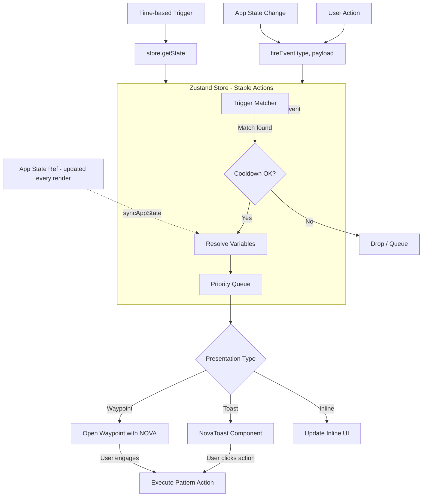

# NOVA Active Interaction Design

## 1. Current State Analysis

NOVA currently operates in a **reactive, chat-driven model**:

- **4 Programs** (Briefing, Focus, Re-group, Preview) — each is a chat session with a system prompt
- **Knowledge Pool** — manually curated + AI-inferred facts about the user
- **Confidence Scoring** — tracks sync events to gauge how well NOVA knows the user
- **Daily Plan Generation** — AI-generated task schedule
- **Weekly Goals Scan** — AI analysis of weekly goal alignment

**Key limitation**: NOVA only speaks when the user opens a program. There's no proactive, context-aware interaction tied to what's happening *in the app*.

---

## 2. Design Philosophy

> **"Hard-coded interaction patterns with variable data"**

The core idea is:
- Define a set of **interaction triggers** (events in the app)
- Each trigger maps to a **hard-coded interaction pattern** (what NOVA says/does)
- The **content** of the interaction is filled with **variable data** from the app state

This avoids the complexity of fully autonomous AI agents while still making NOVA feel proactive and context-aware.

---

## 3. Interaction Architecture

```
┌─────────────────────────────────────────────────────────┐
│                    NovaInteractionEngine                  │
│                                                          │
│  ┌─────────────┐   ┌──────────────┐   ┌──────────────┐  │
│  │ Interaction  │──▶│  Pattern     │──▶│  Action      │  │
│  │ Triggers     │   │  Definitions │   │  Executor    │  │
│  └─────────────┘   └──────────────┘   └──────────────┘  │
│        │                  │                   │          │
│        ▼                  ▼                   ▼          │
│  App Events         Pattern Library       App Actions    │
│  (user actions,     (hard-coded          (open waypoint, │
│   timers, state      templates with       show toast,    │
│   changes)           variable slots)      update state)  │
└─────────────────────────────────────────────────────────┘
```

### 3.1 Interaction Trigger Sources

| Source | Description | Examples |
|--------|-------------|---------|
| **User Actions** | Explicit user interactions | Completing a task, starting a session, opening a page |
| **App State Changes** | Automatic state transitions | Focus mode entered, session completed, daily plan generated |
| **Time-based** | Scheduled or elapsed-time events | Idle detection, time-of-day prompts, streak milestones |
| **Performance Signals** | Derived from analytics | Streak broken, productivity drop, overrun tasks |

### 3.2 Interaction Pattern Definition

Each pattern is a structured object:

```javascript
{
  id: 'task_completed_celebration',
  trigger: {
    source: 'user_action',
    event: 'task_completed',
    conditions: { minStreak: 3, timeOfDay: 'any' }
  },
  cooldown: { type: 'global', durationMs: 120000 },  // prevent spam
  priority: 'low',  // 'low' | 'medium' | 'high' — determines if it interrupts
  presentation: 'toast',  // 'toast' | 'waypoint' | 'inline' | 'notification'
  template: {
    title: 'Nice work!',
    body: 'You just completed "{taskTitle}". {streakMessage}',
    action: { label: 'View Progress', type: 'open_insights' }
  },
  variables: {
    taskTitle: { source: 'event', path: 'title' },
    streakMessage: { 
      source: 'computed',
      fn: (streak) => streak >= 7 
        ? `That's ${streak} days in a row! 🔥` 
        : `Keep the momentum going!`
    }
  }
}
```

---

## 4. Proposed Interaction Patterns

### Category A: Achievement & Momentum

| # | Trigger | Pattern | Presentation | Priority |
|---|---------|---------|-------------|----------|
| A1 | Task completed (onward item toggled done) | Celebrate + streak update | Toast (auto-dismiss 4s) | Low |
| A2 | Streak milestone (3, 7, 14, 30 days) | Milestone celebration + insight | Waypoint popup | Medium |
| A3 | All tasks for the day completed | "Day complete" summary + wind-down suggestion | Waypoint popup | Medium |
| A4 | First task of the day completed | "First win" acknowledgment | Toast | Low |

### Category B: Check-in & Reflection

| # | Trigger | Pattern | Presentation | Priority |
|---|---------|---------|-------------|----------|
| B1 | Focus session completed (FocusScreen) | Brief reflection prompt + rating reminder | Inline in FocusScreen (already exists) | Low |
| B2 | Pomodoro session overran estimate | Suggest breakdown or journal entry | Toast + inline in Regroup | Medium |
| B3 | User idle > 5min during active session | Gentle nudge to resume or log distraction | Toast | Low |
| B4 | End of work day (configurable time) | Preview prompt: "Want to plan tomorrow?" | Waypoint suggestion | Medium |

### Category C: Intervention & Correction

| # | Trigger | Pattern | Presentation | Priority |
|---|---------|---------|-------------|----------|
| C1 | Streak broken (missed a day) | Non-judgmental reset + offer to regroup | Waypoint popup | High |
| C2 | Multiple tasks deferred (3+ in a row) | Suggest re-evaluating workload/priorities | Waypoint popup | High |
| C3 | Low focus rating (1-2) after session | Offer regrouping or task breakdown | Toast → Waypoint | Medium |
| C4 | High rejection rate (>50% of NOVA suggestions) | Ask if goals need recalibration | Waypoint popup | High |

### Category D: Proactive Suggestions

| # | Trigger | Pattern | Presentation | Priority |
|---|---------|---------|-------------|----------|
| D1 | App opened / day started (first interaction) | Briefing prompt if no briefing done today | Waypoint suggestion | Medium |
| D2 | New goal created | Offer to break it down or schedule first task | Toast | Low |
| D3 | Goal nearing deadline (< 3 days, < 50% done) | Urgent check-in + offer to reprioritize | Waypoint popup | High |
| D4 | Low task completion rate (< 2 tasks/day for 3 days) | Suggest reducing scope or regrouping | Waypoint popup | Medium |

### Category E: Contextual Awareness

| # | Trigger | Pattern | Presentation | Priority |
|---|---------|---------|-------------|----------|
| E1 | User navigates to a page (Onward, Map, etc.) | Brief contextual tip about that view | Inline tooltip | Low |
| E2 | User opens a goal in waypoint | Show related knowledge or past insight | Inline in waypoint | Low |
| E3 | Brain dump entry during focus session | Acknowledge + suggest addressing later | Inline in FocusScreen (already exists) | Low |

---

## 5. Variable Data Sources

Each interaction pattern pulls variables from these sources:

### 5.1 Event Payload
Data passed directly from the triggering action:
```javascript
// Example: task_completed event
{
  type: 'task_completed',
  taskId: 'abc123',
  title: 'Implement auth middleware',
  goalId: 'proj456',
  goalTitle: 'Build API',
  completedAt: '2026-06-12T10:30:00Z',
  estimatedMinutes: 60,
  actualMinutes: 75
}
```

### 5.2 App State Queries
Derived from current application state:
```javascript
// Computed on-demand when pattern fires
{
  currentStreak: calcStreak(),
  todayCompletedCount: getTodayCompletedCount(),
  weeklyAvg: getWeeklyAverage(),
  activeProgram: waypointContext?.type,
  currentPage: activePage,
  confidence: computePlanningConfidence(syncEvents),
  pendingDeferredCount: deferredItems.length,
  backlogCount: backlogItems.length,
  overdueGoals: getOverdueGoals(projects),
  // ... etc
}
```

### 5.3 Knowledge Pool
User-specific facts stored in the knowledge pool:
```javascript
{
  preferences: knowledgePool.entries.filter(e => e.cat === 'prefs'),
  workStyle: knowledgePool.entries.filter(e => e.cat === 'work'),
  goals: knowledgePool.entries.filter(e => e.cat === 'goals'),
  context: knowledgePool.entries.filter(e => e.cat === 'context'),
  corrections: knowledgePool.corrections
}
```

---

## 6. Cooldown & Priority System

To prevent NOVA from being annoying:

```
Priority Levels:
  Low    → Toast only, auto-dismiss, no sound
  Medium → Toast with action button, or subtle waypoint badge
  High   → Waypoint popup, slight delay before showing

Cooldown Rules:
  - Global cooldown: 30s between any NOVA interactions
  - Per-pattern cooldown: configurable per pattern (default 2min)
  - Category cooldown: max 1 interaction per category per 5min
  - Session cooldown: don't repeat same pattern twice in one session

Queue System:
  - High priority interrupts low priority
  - Same priority: FIFO queue
  - If queue > 3 items, oldest low-priority items are dropped
```

---

## 7. Implementation Plan

### Phase 1: Core Engine (Zustand Store + Hook)

**Critical Design Constraint: Referential Stability**

The engine uses timers (cooldowns, idle detection), event listeners, and `useEffect` cleanup. If callbacks or data references change on every render, timers will never fire, listeners will be re-attached on every render, and the system will be broken. **Zustand** solves this because store actions are created once and never change reference.

#### Step 1a: Create the Zustand Store

Create [`src/store/novaInteractionStore.js`](src/store/novaInteractionStore.js):

```javascript
import { create } from 'zustand';

export const useNovaInteractionStore = create((set, get) => ({
  // --- State ---
  cooldowns: {},           // { patternId: expiryTimestamp }
  queue: [],               // pending interaction queue
  toastQueue: [],          // currently visible toasts
  idleTimer: null,         // timer ID for idle detection

  // --- Actions (stable references, created once) ---

  fireEvent: (type, payload) => {
    const state = get();
    // 1. Match triggers against pattern registry
    // 2. Check cooldowns via _checkCooldown
    // 3. Resolve variables from event payload + app state
    // 4. Push to queue or show toast
  },

  dismissToast: (toastId) => {
    set((state) => ({
      toastQueue: state.toastQueue.filter(t => t.id !== toastId),
    }));
  },

  clearQueue: () => set({ queue: [] }),

  // --- Internal helpers ---

  _checkCooldown: (patternId) => {
    const cooldowns = get().cooldowns;
    return !cooldowns[patternId] || Date.now() > cooldowns[patternId];
  },

  _setCooldown: (patternId, durationMs) => {
    set((state) => ({
      cooldowns: {
        ...state.cooldowns,
        [patternId]: Date.now() + durationMs,
      },
    }));
  },
}));
```

#### Step 1b: Create the Interaction Hook

Create [`src/hooks/useNovaInteractions.js`](src/hooks/useNovaInteractions.js):

```javascript
import { useEffect, useRef } from 'react';
import { useNovaInteractionStore } from '../store/novaInteractionStore';

export function useNovaInteractions() {
  const store = useNovaInteractionStore();

  // Use refs to hold latest app state without triggering re-renders
  const appStateRef = useRef({});
  
  // This is called by App.jsx on every render to keep ref current
  const syncAppState = (appState) => {
    appStateRef.current = appState;
  };

  // Timers and intervals use store.getState() to read latest state
  // without needing stable callback references
  useEffect(() => {
    const idleTimer = setInterval(() => {
      const state = useNovaInteractionStore.getState();
      // Check idle time, fire idle events if needed
    }, 30000);

    return () => clearInterval(idleTimer);
  }, []); // Empty deps — stable because we use store.getState()

  return {
    fireEvent: store.fireEvent,
    dismissToast: store.dismissToast,
    clearQueue: store.clearQueue,
    queue: store.queue,
    toastQueue: store.toastQueue,
    syncAppState,  // called by App.jsx each render
  };
}
```

#### Why This Fixes Referential Instability

| Approach | Problem | Solution |
|----------|---------|----------|
| Props-based hook | Inline callbacks + arrays from state create new refs every render → `useEffect` cleanup re-runs → timers never fire | ❌ Broken |
| `useRef` pattern inside hook | Store latest callbacks/data in refs; `useEffect` deps are empty/stable | ✅ Works |
| Zustand store | Actions are created once, never change reference; `store.getState()` reads latest data without deps | ✅ Best |

### Phase 2: Pattern Definitions

Create [`src/constants/novaInteractions.js`](src/constants/novaInteractions.js) — the registry of all interaction patterns.

### Phase 3: Integration Points

Modify these files to emit events:

| File | Events to Emit |
|------|---------------|
| [`src/App.jsx`](src/App.jsx) | `task_completed`, `goal_created`, `goal_completed`, `page_navigated`, `app_opened`, `streak_milestone` |
| [`src/components/views/FocusScreen.jsx`](src/components/views/FocusScreen.jsx) | `session_completed`, `focus_rated`, `brain_dump_added` |
| [`src/components/nova/NOVAProgramPanel.jsx`](src/components/nova/NOVAProgramPanel.jsx) | `briefing_done`, `preview_done`, `task_accepted`, `task_rejected` |
| [`src/components/nova/RegroupPanel.jsx`](src/components/nova/RegroupPanel.jsx) | `regroup_reflection_saved` |

### Phase 4: Presentation Components

Create toast/notification UI components:

- [`src/components/nova/NovaToast.jsx`](src/components/nova/NovaToast.jsx) — small auto-dismiss toast with optional action
- [`src/components/nova/NovaSuggestionBadge.jsx`](src/components/nova/NovaSuggestionBadge.jsx) — subtle badge on waypoint/sidebar

---

## 8. Data Flow Diagram



---

## 9. Key Design Decisions

### Decision 1: Zustand Store vs Props for the Engine
**Chosen: Zustand store with a thin React hook wrapper**

- **Why not props?** Passing callbacks and data as hook dependencies causes referential instability. Every render creates new function references for inline callbacks, and arrays from state (`projects`, `onwardItems`) are new references every render. This causes `useEffect` cleanup/re-run loops that break timers, cooldowns, and event listeners.
- **Why Zustand?** Store actions are created once and never change reference. `store.getState()` reads the latest data without needing it as a dependency. This makes timers, intervals, and event listeners stable.
- **The hook wrapper** (`useNovaInteractions`) provides a `syncAppState` function that uses a `useRef` to hold the latest app state without triggering re-renders.

### Decision 2: Template Variables vs Full AI Generation
**Chosen: Template variables with optional AI enhancement**
- Base messages use hard-coded templates with variable slots
- For high-priority patterns (C1, C2, C4), optionally enhance with an AI call using the existing `chatWithNOVA` API
- This keeps 80% of interactions fast and deterministic

### Decision 3: Toast vs Waypoint
**Chosen: Both, based on priority**
- Low priority → Toast (non-blocking, auto-dismiss)
- Medium priority → Toast with action button
- High priority → Waypoint popup (user must acknowledge)

### Decision 4: Cooldown Strategy
**Chosen: Multi-level cooldown**
- Global: 30s between any interactions
- Per-pattern: configurable (default 2min)
- Category: max 1 per 5min per category
- Session: don't repeat same pattern twice

### Decision 5: Ref Pattern for Timers and Intervals
**Chosen: Empty dependency array + `store.getState()` for all timers**

- Timers (idle detection, cooldown checks) use `useEffect` with `[]` deps
- Inside the timer callback, use `useNovaInteractionStore.getState()` to read the latest state
- This avoids the "timer never fires" bug where `useEffect` cleanup re-runs on every render because a dependency changed reference
- The `syncAppState` pattern (via `useRef`) is used for data that the store needs but doesn't own (e.g., `projects`, `onwardItems`)

---

## 10. Risks & Mitigations

| Risk | Mitigation |
|------|-----------|
| NOVA becomes annoying/interruptive | Aggressive cooldowns, priority system, user can dismiss all |
| Performance impact from state queries | Memoize computed values, lazy evaluation |
| Too many patterns to maintain | Start with 8-10 core patterns, add more based on usage |
| AI-enhanced patterns are slow | Only use AI for high-priority patterns; templates for everything else |
| User feels monitored | All interactions are local; no data leaves the app; transparent about triggers |
| **Referential instability breaks timers/cooldowns** | **Use Zustand store for stable action references; useRef for app state; empty dep arrays for timers** |

---

## 11. Next Steps

1. Install Zustand: `npm install zustand`
2. Create [`src/store/novaInteractionStore.js`](src/store/novaInteractionStore.js) — the Zustand store with `fireEvent`, cooldown management, queue
3. Create [`src/hooks/useNovaInteractions.js`](src/hooks/useNovaInteractions.js) — the React hook wrapper with `syncAppState` ref pattern
4. Create [`src/constants/novaInteractions.js`](src/constants/novaInteractions.js) — pattern definitions (start with 8-10)
5. Create [`src/components/nova/NovaToast.jsx`](src/components/nova/NovaToast.jsx) — toast UI
6. Integrate `fireEvent` calls into [`src/App.jsx`](src/App.jsx) and other components
7. Wire up the hook in [`src/App.jsx`](src/App.jsx) and pass to relevant components
8. Test with real usage patterns
9. Iterate on patterns based on feedback
